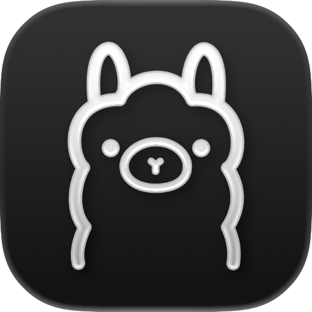

  <picture>
    
  </picture>
  <h1 align="center">Raycast Ollama</h1>

Use [Ollama](https://ollama.ai) for local llama inference on Raycast. This application is not directly affiliated with Ollama.ai.

## Requirements

[Ollama](https://ollama.ai) installed and running on your mac. At least one model need to be installed throw Ollama cli tools or with 'Manage Models' Command. You can find all available model [here](https://ollama.ai/library).

## How to Use

### Command: Chat With Ollama

Chat with your preferred model from Raycast, with the following features:

- *CMD+M*, "Change Model": change model when you want and use different one for vision or embedding.
- *CMD+S*, "Selection": Add text from selection or clipboard to the prompt.
- *CMD+B*, "Browser Selection Tab": Add content from selected tab to the prompt. Raycast Browser Extention is required.
- *CMD+I*, "Image From Clipboard": Add jpeg or png image to te prompt. A Model with vision capabilities is required.
- *CMD+F*, "File": Add content from files. THis feature is still experimental.

From extentions preferences you can chose how many messages use as memory. By default it use the last 20 messages.

### Command: Create Custom Commands

All preconfigured commands are crafted for general use. This command permits you to create a custom command for your specific needs.
